
  此页内容待完善


## CPU 测试

### 方式一：CPU-Z 基准测试

> 此方法适用于 WinPE 环境

在 WinPE 中使用 CPU-Z 进行 CPU 基准测试，此处测得的超融合集群节点1 单核为 386 分、多核为 7236分


CPU-Z 跑分参考为：

- 旗舰 CPU：

  单核大于 700、多核大于 10万，比如 AMD EPYC 9575F（单核约为 800 分，多核约为 11 万分），可跑重度虚拟化、HPC 。

- 主流 CPU：

  单核 300 ~ 600、多核 3000 ~ 9000，比如 AMD EPYC 7702（单核约为 350 分，多核约为 3 万分），适合高并发 Web、数据库。

- 轻量 CPU：

  单核小于 250、多核小于 1000，比如 Intel Celeron J1900（单核约为 70  分，多核约为 300 分），仅作软路由、NAS、低负载网关 。

各设备 CPU-Z 基准测试结果如下（附有测试结果查看链接）：

|设备|单核得分|多核得分|CPU 名称|CPU 频率|测试结果查看链接|
| -----------------| ----------| ----------| -----------------------| -------------| ------------------|
|超融合集群节点1|386|7236|Intel Xeon E5-2695 v4|2594.83 MHz|[Intel Xeon v4 @ 2594.83 MHz - CPU-Z VALIDATOR](https://valid.x86.fr/btxlpp)|
|超融合集群节点2|71|285|Intel Celeron J1900|1999.1 MHz|[Intel Celeron J1900 @ 1999.1 MHz - CPU-Z VALIDATOR](https://valid.x86.fr/1lda4s)|
|超融合集群节点3|71|282|Intel Celeron J1900|1999.1 MHz|[Intel Celeron J1900 @ 1999.1 MHz - CPU-Z VALIDATOR](https://valid.x86.fr/y9c805)|
|主数据库设备|72|287|Intel Celeron J1900|1999.1 MHz|[Intel Celeron J1900 @ 1999.1 MHz - CPU-Z VALIDATOR](https://valid.x86.fr/087q5y)|
|从数据库设备1|72|285|Intel Celeron J1900|1999.1 MHz|[Intel Celeron J1900 @ 1999.1 MHz - CPU-Z VALIDATOR](https://valid.x86.fr/149g8z)|
|从数据库设备2|88|180|Intel Celeron J1800|2416.62 MHz|[Intel Celeron J1800 @ 2416.62 MHz - CPU-Z VALIDATOR](https://valid.x86.fr/rawub2)|

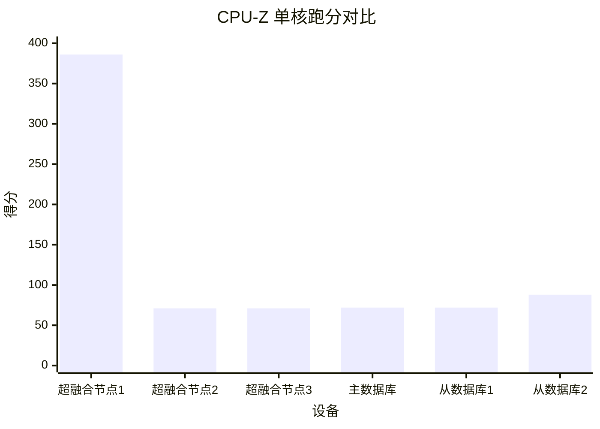

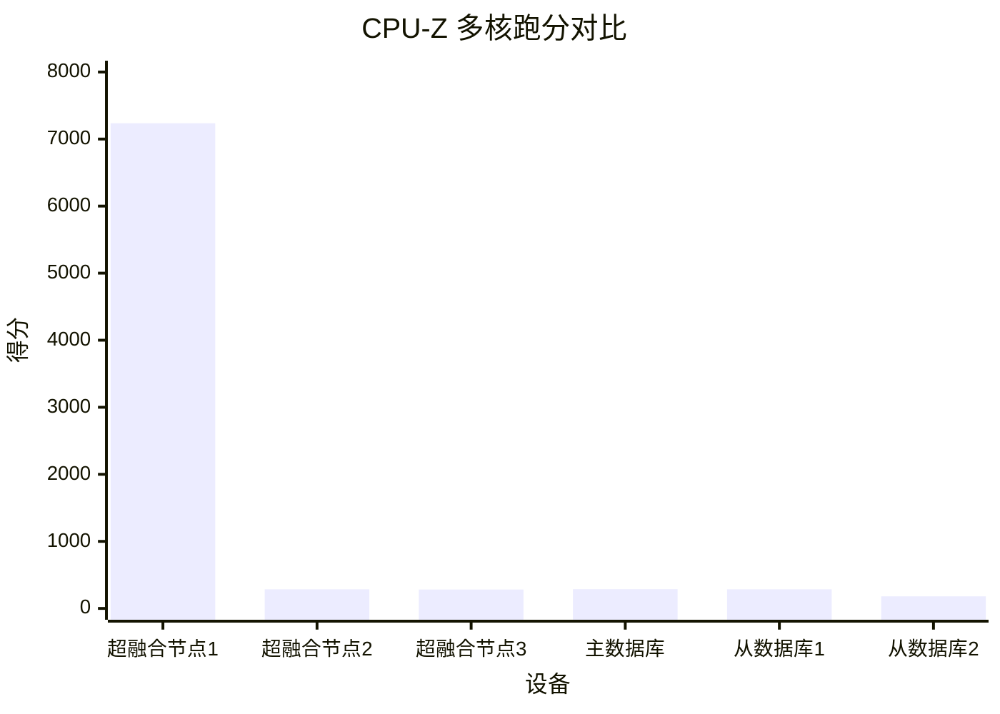

### 方式二：Geekbench 6 基准测试

参考链接：[Geekbench 6 - Cross-Platform Benchmark](https://www.geekbench.com/)

> 此方法可用于 Linux 环境‍

将下载的压缩文件上传到服务器，解压后即可直接运行，比如上传压缩文件到当前用户家目录后，可进行如下操作进行基准测试

```bash
GEEKBENCH_VERSION="6.4.0"

# 切换到当前用户家目录
cd

# 创建目标文件夹并解压文件
mkdir -p Geekbench && \
  tar -xzvf Geekbench-${GEEKBENCH_VERSION}-Linux.tar.gz -C Geekbench --strip-components=1

# 递归赋予可执行权限
chmod -R +x Geekbench/

# 运行 Geekbench
./Geekbench/geekbench6

```

Geekbench 6 跑分参考为：

- 旗舰 CPU：

  单核大于 2500、多核大于 5万，比如 AMD EPYC 9575F（单核约为 2800 分，多核约为 10 万分），可跑重度虚拟化、HPC 。

- 主流 CPU：

  单核 1000 ~ 2000、多核 5000 ~ 15000，比如 AMD EPYC 7702（单核约为 350 分，多核约为 1 万分），适合高并发 Web、数据库。

- 轻量 CPU：

  单核小于 500、多核小于 1000，比如 Intel Celeron J1900（单核约为 150  分，多核约为 500 分），仅作软路由、NAS、低负载网关 。

各设备 Geekbench 6 基准测试结果如下（附有测试结果查看链接）：

|设备|单核得分|多核得分|CPU 名称|CPU 频率|测试结果查看链接|
| -----------------| ----------| ----------| -----------------------| ----------| ------------------|
|超融合集群节点1|1113|8566|Intel Xeon E5-2695 v4|3.30 GHz|[INTEL X99 - Geekbench](https://browser.geekbench.com/v6/cpu/12786975)|
|超融合集群节点2|155|319|Intel Celeron J1900|2.00 GHz|[Centerm D610 - Geekbench](https://browser.geekbench.com/v6/cpu/12787312)|
|超融合集群节点3|154|489|Intel Celeron J1900|2.00 GHz|[Centerm D610 - Geekbench](https://browser.geekbench.com/v6/cpu/12787313)|
|主数据库设备|154|485|Intel Celeron J1900|2.00 GHz|[Centerm D610 - Geekbench](https://browser.geekbench.com/v6/cpu/12787315)|
|从数据库设备1|155|471|Intel Celeron J1900|2.00 GHz|[Centerm N610 - Geekbench](https://browser.geekbench.com/v6/cpu/12787319)|
|从数据库设备2|155|320|Intel Celeron J1800|2.42 GHz|[Centerm C93 - Geekbench](https://browser.geekbench.com/v6/cpu/12787353)|

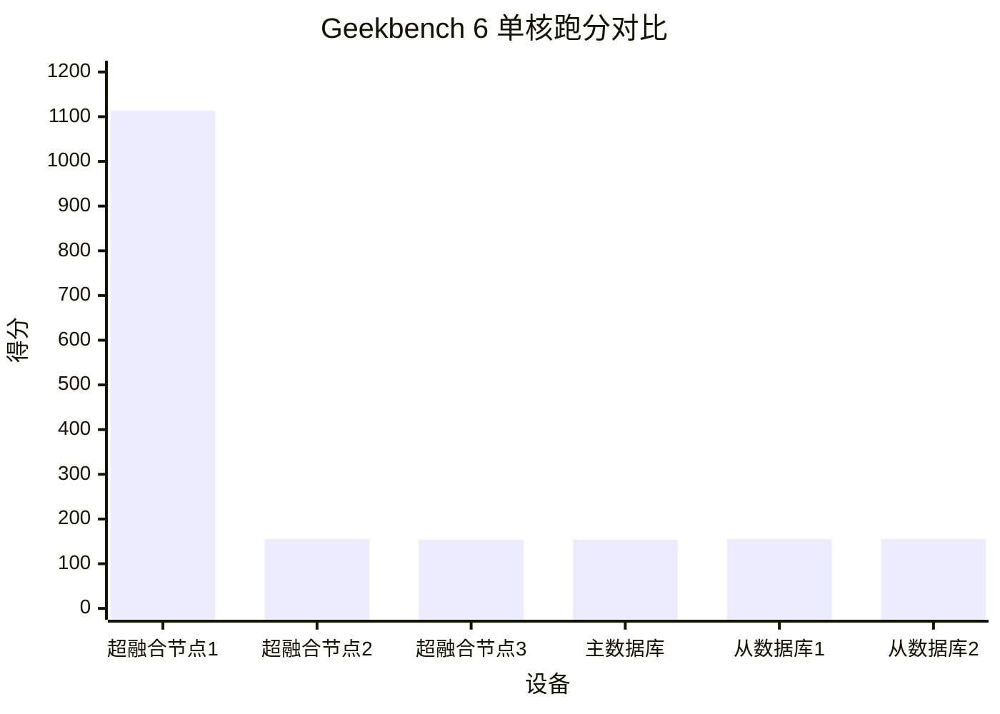

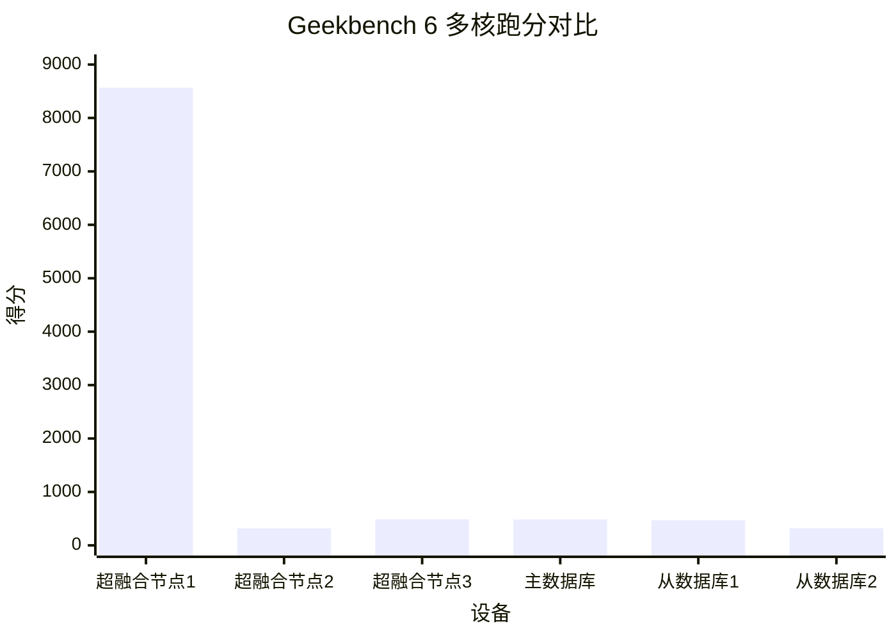

## 内存测试

> 在 WinPE 中进行内存测试

### 内存性能测试

使用 AIDA64 Cache & Memory Benchmark 测试 CPU 缓存与内存的性能，并查看内存通道数。此处测得的超融合集群节点1 内存读速度约为 62GB/s，写速度约为 56GB/s，复制速度约为 55GB/s，延迟约为 88ns。内存通道数为四。


以下是内存速度和不同缓存层级的参考：

- 内存速度：

  - DDR3内存：通常在 10000 MB/s 至 20000 MB/s之间。
  - DDR4内存：通常在 20000 MB/s 至 40000 MB/s之间。
  - DDR5内存：通常超过 50000 MB/s。

- 缓存速度跟核心架构、制程、频率都强相关，此处给出主流 CPU 缓存参考：

  - L1缓存：800 GB/s 至 2200 GB/s之间
  - L2缓存：200 GB/s 至 600 GB/s之间
  - L3缓存：80 GB/s 至 250 GB/s之间

- 延迟：

  - L1缓存延迟：0.5 ns 至 1 ns之间。
  - L2缓存延迟：3 ns 至 12 ns之间。
  - L3缓存延迟：12 ns 至 25 ns之间。
  - 内存延迟：60 ns 至 100 ns之间，具体取决于内存类型和配置。

各设备内存性能测试结果如下：

|设备|内存读取(MB/s)|内存写入(MB/s)|内存复制(MB/s)|内存延迟(ns)|L1缓存读取(GB/s)|L1缓存写入(GB/s)|L1缓存复制(GB/s)|L1缓存延迟(ns)|L2缓存读取(GB/s)|L2缓存写入(GB/s)|L2缓存复制(GB/s)|L2缓存延迟(ns)|L3缓存读取(GB/s)|L3缓存写入(GB/s)|L3缓存复制(GB/s)|L3缓存延迟(ns)|
| -----------------| ----------------| ----------------| ----------------| --------------| ------------------| ------------------| ------------------| ----------------| ------------------| ------------------| ------------------| ----------------| ------------------| ------------------| ------------------| ----------------|
|超融合集群节点1|62566|56350|55228|88.3|2861.9|1457.9|2913.6|1.2|959.16|445.25|618.63|3.7|312.93|220.67|258.61|23.7|
|超融合集群节点2|9135|9062|8555|95.6|124.62|123.31|118.00|1.5|48.625|31.859|47.632|14.0|-|-|-|-|
|超融合集群节点3|9118|9097|8619|95.6|124.59|124.20|117.83|1.5|48.737|31.556|44.318|13.7|-|-|-|-|
|主数据库设备|9114|9055|8529|96.4|124.58|123.00|119.23|1.5|67.883|31.519|43.344|14.7|-|-|-|-|
|从数据库设备1|8903|8329|8371|96.4|124.59|123.57|119.49|1.5|48.678|31.634|47.858|13.8|-|-|-|-|
|从数据库设备2|8009|5224|7568|93.3|77.118|76.803|76.198|1.3|46.458|21.697|32.799|12.9|-|-|-|-|

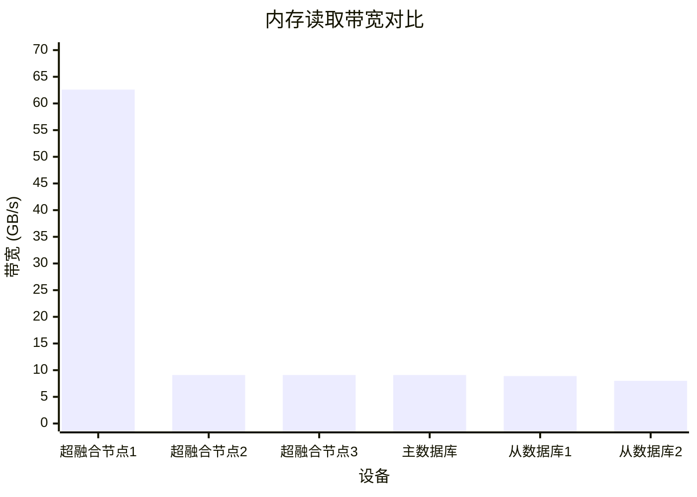

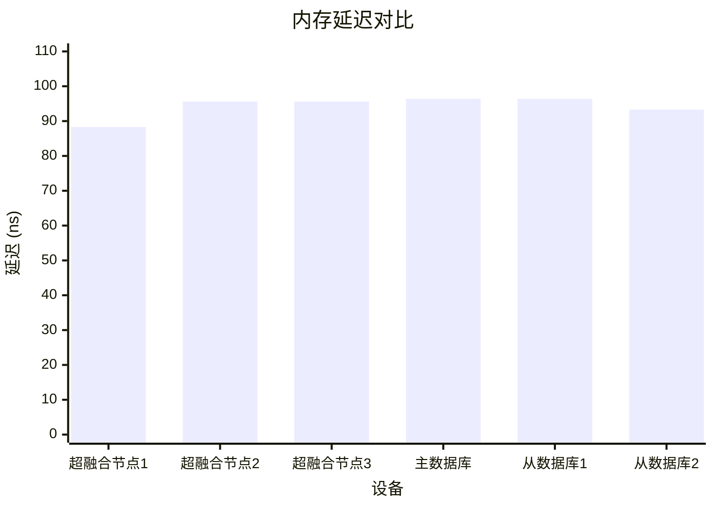

### 内存稳定性测试

使用 TestMem5 进行内存稳定性测试，此处简单测试内存稳定性，仅运行一轮测试


## 硬盘测试

参考链接：

[NAND Flash存储器与SSD简介 - SSD Fans](http://www.ssdfans.com/?p=2495)

[FTL之垃圾回收、写放大和OP - SSD Fans](http://www.ssdfans.com/?p=8163)

[产品技术 - 创见资讯](https://cn.transcend-info.com/Embedded/Technologies/)

[专业技术-建兴储存科技 SSSTC Technology Corporation](https://www.ssstc.com/cn/technology/)

因为所有服务器均为全闪配置，硬盘测试统一按固态硬盘的标准执行。

固态硬盘的存储芯片大多采用 NAND Flash，其最小物理存储单元是浮栅 MOSFET 晶体管。这种晶体管通过在栅极施加电压，利用量子隧穿效应将电子吸引到浮栅中，并根据存储的电子数量人为划分出几种不同的状态。为了确保浮栅中的电子数量可控，在吸引电子之前，需要先向衬底施加高电压，将浮栅中的电子吸出，以消除其他电子的干扰。因此，每次向固态硬盘写入数据前，都需要先进行擦除操作。正是由于这种“先擦除后写入”的特性，才衍生出了诸如垃圾回收、TRIM 和磨损均衡等多种机制，以避免因长时间擦除而导致的等待延迟。

鉴于固态硬盘工作模式的复杂性，并且不同的使用场景对固态硬盘的性能要求也不一致，所以最终需要根据实际情况对硬盘进行综合评估。

### 查看固态硬盘 S.M.A.R.T.

固态硬盘的 S.M.A.R.T. 数据保存在主控芯片内，可以使用工厂级量产工具或刷固件的方式重置，从而呈现虚假的统计结果。故 S.M.A.R.T. 仅作初步判断固态硬盘情况的参考。

查看固态硬盘 S.M.A.R.T. 信息的方法有很多，这里以 CrystalDiskInfo 为例进行演示。可以根据软件给出的“健康状态”来初步判断硬盘状态，当 S.M.A.R.T. 中没有定义剩余寿命时则可查看“总计写入”，结合厂商给定的 TBW 总写入字节初步判断硬盘状态。

除了“健康状态”与“总计写入”之外，还应根据 S.M.A.R.T. 中的其他参数判断硬盘状态，下面给出一些较为重要的参数：

|ID|属性名称|含义|
| ----| ----------------------------| --------------------------------|
|05|重新分配扇区数|已重映射扇区的坏块数量|
|C4|扇区物理位置重分配事件计数|已发生屏蔽坏块事件的次数|
|C5|有待处置扇区数|状态存疑，需保持关注的扇区数量|
|C7|CRC 错误计数|线材或接口异常|

此处给出超融合集群节点1的硬盘 S.M.A.R.T. 信息：


### 安全擦除固态硬盘

参考链接：

[如何安全地擦除/抹掉固态硬盘数据 - Lemonade](https://limonene.top/2024-01-10/%E5%A6%82%E4%BD%95%E5%AE%89%E5%85%A8%E5%9C%B0%E6%93%A6%E9%99%A4-%E6%8A%B9%E6%8E%89%E5%9B%BA%E6%80%81%E7%A1%AC%E7%9B%98%E6%95%B0%E6%8D%AE/)

[Secure Erase 和 Sanitize 的区别是什么 | Western Digital](https://support-cn.wd.com/app/answers/detailweb/a_id/43969/~/secure-erase%E5%92%8Csanitize%E7%9A%84%E5%8C%BA%E5%88%AB%E6%98%AF%E4%BB%80%E4%B9%88)

Secure Erase 与 Sanitize 是固态硬盘的两种擦除方式：Secure Erase 仅清除映射表，相当于删除文件索引；Sanitize 不仅删除映射表，还会物理擦除所有已写入的块，彻底清除盘上全部数据，无法恢复。这两种硬盘擦除方式通常都能在一分钟内完成，比动辄数小时的全盘写入快得多，这里实测 1 TB 固态硬盘能在 10 秒内完成全盘擦除。

#### 安全擦除 NVMe 硬盘

安装 nvme-cli 命令行工具

```bash
sudo apt -y update && sudo apt -y install nvme-cli

```

查看 NVMe 设备：

```bash
sudo nvme list

```

🖥️ 示例输出：

```bash
Node                  Generic               SN                   Model                                    Namespace Usage                      Format           FW Rev  
--------------------- --------------------- -------------------- ---------------------------------------- --------- -------------------------- ---------------- --------
/dev/nvme0n1          /dev/ng0n1            002115101B16         SSSTC CA6-8D1024                         1           1.02  TB /   1.02  TB    512   B +  0 B   ERA2101 
```

此处待测试的硬盘设备地址为：`/dev/nvme0n1`​

查看 NVMe 硬盘是否支持安全擦除（Secure Erase）或深度擦除（Sanitize）：

```bash
sudo nvme id-ctrl -H /dev/nvme0n1 | grep "fna" -A 5
sudo nvme id-ctrl -H /dev/nvme0n1 | grep "sanicap" -A 5

```

🖥️ 示例输出：

```bash

fna       : 0
  [3:3] : 0     Format NVM Broadcast NSID (FFFFFFFFh) Supported
  [2:2] : 0     Crypto Erase Not Supported as part of Secure Erase
  [1:1] : 0     Crypto Erase Applies to Single Namespace(s)
  [0:0] : 0     Format Applies to Single Namespace(s)

sanicap   : 0xa0000002
  [31:30] : 0x2 Media is additionally modified after sanitize operation completes successfully
  [29:29] : 0x1 No-Deallocate After Sanitize bit in Sanitize command Not Supported
    [2:2] : 0   Overwrite Sanitize Operation Not Supported
    [1:1] : 0x1 Block Erase Sanitize Operation Supported
    [0:0] : 0   Crypto Erase Sanitize Operation Not Supported

```

这里显示这块 NVMe 固态支持 Block Erase 方式的 Sanitize 深度擦除

采用 Sanitize 完成全盘擦除：

```bash
sudo nvme sanitize --sanact=2 /dev/nvme0n1 
```

查看擦除进度：

```bash
sudo nvme sanitize-log -H /dev/nvme0n1

```

🖥️ 示例输出：

```bash
Sanitize Progress                      (SPROG) :  23297 (35.548401%)
Sanitize Status                        (SSTAT) :  0x2
        [2:0]   Sanitize in Progress.
        [7:3]   Number of completed passes if most recent operation was overwrite:      0
          [8]   Global Data Erased cleared: a NS LB in the NVM subsystem has been written to or a PMR in the NVM subsystem has been enabled
Sanitize Command Dword 10 Information (SCDW10) :  0x2
Estimated Time For Overwrite                   :  4294967295 (No time period reported)
Estimated Time For Block Erase                 :  4294967295 (No time period reported)
Estimated Time For Crypto Erase                :  4294967295 (No time period reported)
Estimated Time For Overwrite (No-Deallocate)   :  4294967295 (No time period reported)
Estimated Time For Block Erase (No-Deallocate) :  4294967295 (No time period reported)
Estimated Time For Crypto Erase (No-Deallocate):  4294967295 (No time period reported)

```

等待擦除完成，此处实测等待时间在 10 秒钟以内。当显示 Most Recent Sanitize Command Completed Successfully 时，即擦除完成。

#### 安全擦除 SATA 硬盘

安装 hdparm 命令行工具

```bash
sudo apt -y update && sudo apt -y install hdparm

```

查看当前的 SATA 硬盘设备：

```bash
sudo fdisk -l | grep "Disk /dev/sd" -A 5

```

🖥️ 示例输出：

```plaintext
Disk /dev/sda：55.9 GiB，60022480896 字节，117231408 个扇区
磁盘型号：ShineDisk M667 6
单元：扇区 / 1 * 512 = 512 字节
扇区大小(逻辑/物理)：512 字节 / 512 字节
I/O 大小(最小/最佳)：512 字节 / 512 字节

--
Disk /dev/sdb：30 GiB，32212254720 字节，62914560 个扇区
磁盘型号：Flash Disk      
单元：扇区 / 1 * 512 = 512 字节
扇区大小(逻辑/物理)：512 字节 / 512 字节
I/O 大小(最小/最佳)：512 字节 / 512 字节
磁盘标签类型：dos
```

此处待测试的硬盘设备地址为：`/dev/sda`​

查看 SATA 硬盘是否支持深度擦除（Sanitize）：

```bash
sudo hdparm -I /dev/sda | grep "SANITIZE feature set" -A 5

```

🖥️ 示例输出：

```bash
	   *	SANITIZE feature set
	   *	BLOCK_ERASE_EXT command
	   *	DOWNLOAD MICROCODE DMA command
	   *	WRITE BUFFER DMA command
	   *	READ BUFFER DMA command
	   *	Data Set Management TRIM supported (limit 8 blocks)
```

- SATA 固态硬盘支持 Sanitize 深度擦除

  这里显示支持 Block Erase 模式的 Sanitize 深度擦除

  全盘深度擦除：

  ```bash
  hdparm --yes-i-know-what-i-am-doing --sanitize-block-erase /dev/sda
  ```

  查看擦除进度：

  ```bash
  hdparm --sanitize-status /dev/sda
  ```

  🖥️ 示例输出：

  ```bash
  /dev/sda:
  Issuing SANITIZE_STATUS command
  Sanitize status:
      State:    SD2 Sanitize operation In Process
      Progress: 0x41c2 (25%)

  ```

  等待擦除完成，这个过程通常不会超过一分钟。当显示 Last Sanitize Operation Completed Without Error 时，即擦除完成。

- SATA 固态硬盘不支持 Sanitize 深度擦除

  如果 SATA 硬盘不支持 Sanitize 深度擦除，则使用安全擦除：

  参考链接：[Advanced: Erasing SATA Drives by using the Linux hdparm Utility - GROK Knowledge Base](https://grok.lsu.edu/article.aspx?articleid=16716)

  查看是否支持安全擦除：

  ```bash
  sudo hdparm -I /dev/sda | grep "Security:" -A 10

  ```

  🖥️ 示例输出：

  ```bash
  Security: 
          Master password revision code = 65534
                  supported
          not     enabled
          not     locked
                  frozen
          not     expired: security count
                  supported: enhanced erase
          2min for SECURITY ERASE UNIT. 2min for ENHANCED SECURITY ERASE UNIT.
  Checksum: correct
  ```

  此处硬盘还被冻结着，显示 `frozen`，需要解冻。

  睡眠电脑等待几秒钟后开机，让硬盘解冻：

  ```bash
  echo -n mem > /sys/power/state

  ```

  设置安全擦除密码：

  ```bash
  hdparm --user-master username --security-set-pass password /dev/sda
  hdparm -I /dev/sda | grep "Security:" -A 10

  ```

  🖥️ 示例输出：

  显示 `enabled` 和 `Security level high`​

  ```bash
  Security: 
          Master password revision code = 65534
                  supported
                  enabled
          not     locked
          not     frozen
          not     expired: security count
                  supported: enhanced erase
          Security level high
          2min for SECURITY ERASE UNIT. 2min for ENHANCED SECURITY ERASE UNIT.
  ```

  执行安全擦除命令：

  ```bash
  # 支持增强擦除
  hdparm --user-master username --security-erase-enhanced password /dev/sda
  hdparm -I /dev/sda | grep "Security:" -A 10
  # 不支持增强擦除
  # hdparm --user-master username --security-erase password /dev/sda
  ```

  🖥️ 示例输出：

  恢复正常

  ```bash
  Security: 
          Master password revision code = 65534
                  supported
          not     enabled
          not     locked
          not     frozen
          not     expired: security count
                  supported: enhanced erase
          6min for SECURITY ERASE UNIT. 6min for ENHANCED SECURITY ERASE UNIT.
  ```

- （可选）验证擦除效果

  查看硬盘中的数据，结果应全为零

  ```bash
  dd if=/dev/sda bs=4K iflag=direct status=progress | hexdump
  # 只看头部一部分
  # dd if=/dev/sda bs=4K count=10K iflag=direct status=progress | hexdump

  ```

  🖥️ 示例输出：

  ```bash
  0000000 0000 0000 0000 0000 0000 0000 0000 0000
  *
  59970899968 bytes (60 GB, 56 GiB) copied, 398 s, 151 MB/s
  14653926+0 records in
  14653926+0 records out
  df99e6000
  60022480896 bytes (60 GB, 56 GiB) copied, 398.343 s, 151 MB/s

  ```

### 硬盘性能测试

#### 性能测试方式一：ezFIO 固态硬盘稳定态测试

> 在 Linux Live CD 中进行 ezFIO 测试

参考链接：

[ezFIO – Powerful, Simple NVMe SSD Benchmark Tool - NVM Express](https://nvmexpress.org/ezfio-powerful-simple-nvme-ssd-benchmark-tool/)

[earlephilhower/ezfio: Simple NVME/SAS/SATA SSD test framework for Linux and Windows](https://github.com/earlephilhower/ezfio)

[ezfio/ezFIO User Guide.pdf at master · earlephilhower/ezfio](https://github.com/earlephilhower/ezfio/blob/master/ezFIO%20User%20Guide.pdf)

这里使用 ezFIO 测试固态硬盘性能，其是 NVM Express 推荐过的企业级 SSD 综合测试工具，可测试固态硬盘在稳定态下的真实性能表现。ezFIO 的测试流程分为顺序和随机两阶段，共包含 11 个关键步骤：

**Sequential（顺序阶段）：**

1. **第 1 次顺序填充：**    用 **128KB 块大小** 顺序写满整个设备的可寻址空间。
2. **第 2 次顺序填充：**    重复第 1 步，确保 **预留空间（Over-provisioning）**     也被填满。
3. **顺序读测试（按块大小）：**    测试不同块大小的 **顺序读性能**（此时设备已顺序预处理）。
4. **随机读测试（按块大小）：**    测试不同块大小的 **随机读性能**（避免因 4K 随机写预处理导致大块读性能被低估）。
5. **顺序写测试（512B 块，按队列深度）：**    测试 **512B 块大小** 的顺序写性能，并观察 **队列深度** 的影响。
6. **顺序写测试（按块大小）：**    测试 **512B 到 128KB** 不同块大小的顺序写性能。

**Random（随机阶段）：**

7. **第 1 次随机填充：**    用 **4KB 块大小** 随机写满整个设备容量，确保每个 4KB 块都被覆盖。
8. **第 2 次随机填充：**    重复第 1 步，确保 **预留空间** 也被随机填充。
9. **4K 随机读测试（按队列深度）：**    测试 **4KB 随机读性能** 随 **队列深度** 的变化。
10. **4K 混合读写测试（按队列深度）：**    测试 **4KB 块大小的混合读写（如 70% 读 / 30% 写）**     随队列深度的性能。
11. **长期稳定性测试：**    运行 **20 分钟的 4K 随机混合读写（如 70% 读 / 30% 写）**     测试，观察 **IOPS 稳定性**。
12. **4K 随机写测试：**    测试 **纯 4KB 随机写性能**（IOPS 和延迟）。
13. **持续随机写测试（按块大小）：**    测试 **512B 到 128KB** 不同块大小的 **持续随机写性能**。

‍

以下是 ezFIO 稳定态测试的过程：

1. 先确认待测硬盘不是系统盘，避免操作系统读写干扰测试结果。此处使用 Live CD 系统进行测试，从U盘引导启动。
2. 然后对硬盘进行安全擦除操作
3. 使用 ezFIO 对硬盘进行测试，过程如下：

    - 安装 ezFIO

    Windows：

    先安装 fio，然后再将 ezfio 的 github 仓库压缩包下载到本地，解压即可

    Debian：

    ```bash
    apt -y install fio sdparm git && \
      git clone https://ghfast.top/https://github.com/earlephilhower/ezfio

    ```

    - 运行测试

    Windows：

    打开 `ezfio.bat` 脚本文件，会出现 GUI 界面，选择对应硬盘测试即可

    Linux：

    ```bash
    # 单硬盘
    # ./ezfio/ezfio.py --drive /dev/nvme0n1 --utilization 1
    # ./ezfio/ezfio.py --drive /dev/nvme0n1 --yes

    # 防止断连后会话消失
    sudo apt update && sudo apt install tmux
    tmux new -s ezfio

    # 防止终端关闭而导致测试停止
    DEV=/dev/nvme0n1
    # DEV=/dev/sda
    # LOG="ezfio_$(basename "$DEV")_$(date +%Y%m%d_%H%M%S).log"

    ./ezfio/ezfio.py --drive "$DEV" --yes

    # 多硬盘
    # ./ezfio/ezfio.py --drive /dev/sda,/dev/nvme0n1 --yes

    # 如果断连，可重新挂回会话
    # tmux attach -t ezfio     
    ```

‍

下面是 ezFIO 的测试结果：‍

<iframe sandbox="allow-forms allow-presentation allow-same-origin allow-scripts allow-modals allow-popups" src="https://www.kdocs.cn/l/ce2slOMI0Zhp" data-src="" border="0" frameborder="no" framespacing="0" allowfullscreen="true" style="height: 858px; width: 1432px;"></iframe>

测试结果文件名与创建时间：

```bash
# pve-1
-rw-r--r-- 1 root root 194K Aug  5 10:04 ezfio_results_60GB_36cores_2100MHz_sda_debian_2025-08-05_01-14-07.ods
-rw-r--r-- 1 root root 192K Aug  5 17:56 ezfio_results_1024GB_36cores_2100MHz_nvme0n1_debian_2025-08-05_10-16-17.ods

# pve-2
-rw-r--r-- 1 root root 213K Aug  5 14:53 ezfio_results_64GB_4cores_1990MHz_sdb_debian_2025-08-05_03-01-05.ods

# pve-3
-rw-r--r-- 1 root root 211K Aug  5 14:54 ezfio_results_64GB_4cores_1990MHz_sdb_debian_2025-08-05_03-01-06.ods

# pgsql-primary
-rw-r--r-- 1 root root 189K Aug  5 12:10 ezfio_results_128GB_4cores_1990MHz_sda_debian_2025-08-04_17-56-53.ods

# pgsql-replica-1
-rw-r--r-- 1 root root 173K Aug  3 19:54 ezfio_results_128GB_4cores_1990MHz_sda_debian_2025-08-03_16-42-27.ods

# pgsql-replica-2
-rw-r--r-- 1 root root 192K Aug  5 16:24 ezfio_results_128GB_2cores_2410MHz_sda_debian_2025-08-03_21-35-40.ods
```

由文件时间戳和创建时间可知，64 GB 的 SATA 固态硬盘跑完稳定性测试的时间约为 10 小时左右。其中两个 1T 的 SATA 硬盘由于性能原因未能跑完整个测试，最终只有 7 个硬盘跑完了整个稳定态性能测试。不过超融合集群节点3的系统盘出现了掉速问题，被其他同规格硬盘替换，这里值给出 6 块硬盘的测试结果，

下面给出硬盘的持续顺序读写带宽与 4K IOPS：

|设备|顺序读取带宽（MB/s）|顺序写入带宽（MB/s）|持续 4K 混合随机读写（IOPS）|读取延迟（μs）|写入延迟（μs）|
| --------------| ----------------------| ----------------------| ------------------------------| -----------------| -----------------|
|超融合1-SATA|258.76|26.01|2181|298|3279|
|超融合1-NVMe|3449.9|1453.66|75878|73|35|
|超融合2-SATA|274.10|58.61|2198|239|3279|
|主数据库|270.96|134.86|1463|298|1620|
|从数据库1|274.10|183.21|49605|298|3279|
|从数据库2|241.14|43.14|1706|276|1037|

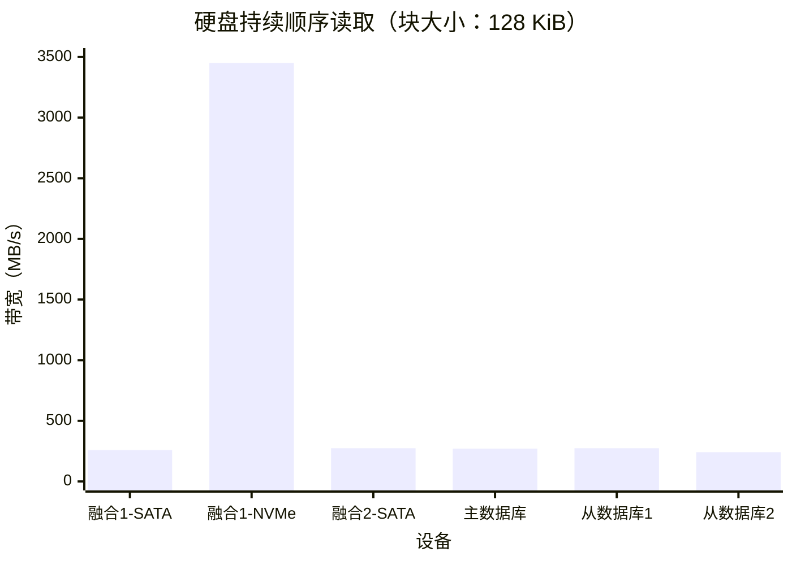

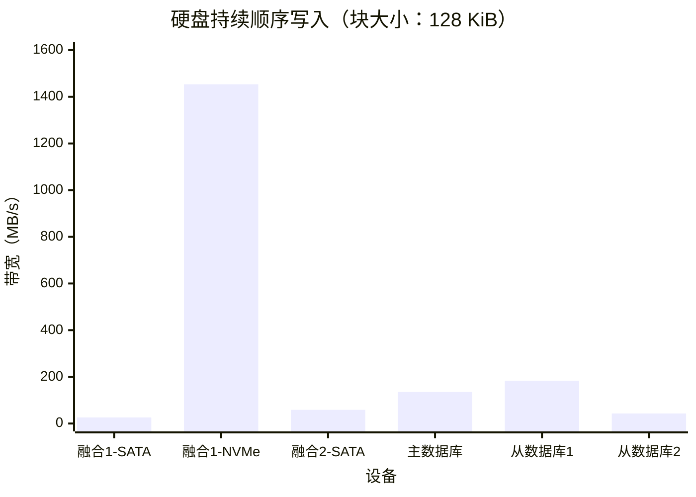

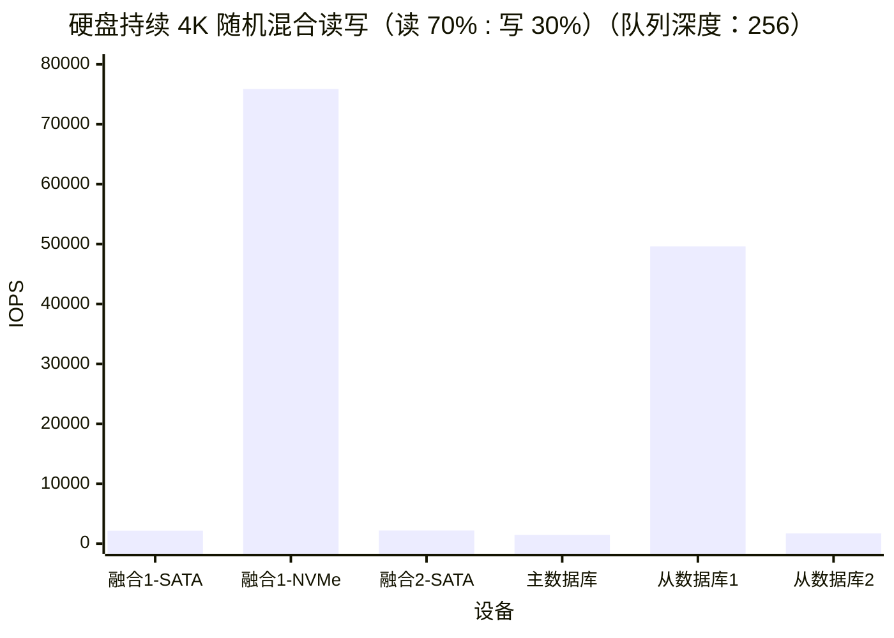

持续测试时的硬盘 4K 读写 1 队列深度的延迟大致在数十到数百微秒左右。

综合各项指标可知 NVMe 固态硬盘表现优秀，读写速度快、延迟低

#### 性能测试方式二：CrystalDiskMark 快速测试

> 在 WinPE 中进行 CrystalDiskMark 测试

硬盘根据使用场景的不同有各种各样的读写方式，如果仅想简单快速的查看硬盘的性能，可用使用消费级固态硬盘的通用测试工具 CrystalDiskMark 8 的 `NVMe 模式` 进行测试。默认情况下，此软件会用指定的队列深度和线程数，对一个事先生成的测试文件做顺序/随机、读/写 IO 操作，根据硬盘在一定时间内的读写总数据量推算 MB/s 与 IOPS。重复此过程五次，取最优值输出。其的默认读写方式为以下四种：

1. **SEQ1M Q8T1**：顺序 1 MiB 读写，队列深度 8，线程数 1。模拟大文件同时读写这类高吞吐量场景。
2. **SEQ128K Q32T1**：顺序 128 KiB 读写，队列深度 32，线程数 1。模拟大文件复制、视频播放、顺序加载场景。
3. **RND4K Q32T16**：随机 4 KiB 读写，队列深度 32，线程数 16。模拟系统盘多任务并发场景，例如读写大量小文件、数据库、游戏加载。
4. **RND4K Q1T1**：随机 4 KiB 读写，队列深度 1，线程数 1。模拟单线程随机读写场景，例如操作系统启动、应用冷启动

以下是 CrystalDiskMark 性能测试的过程：

1. 先确认待测硬盘不是系统盘，避免操作系统读写干扰测试结果。
2. 把整块硬盘划成一个分区，然后对整个分区发送一次 `TRIM` 指令，告知固态硬盘主控芯片，整个硬盘都已不再使用可以全部擦除。使其完成全盘 GC 垃圾回收过程，这一过程大多不超过一分钟的时间。这一过程可以在 WinPE 中使用 DiskGenius 软件完成。

    
3. 使用 CrystalDiskMark 8 对硬盘进行空盘测速，此软件会依次进行读、写、70%读30%写混合测试‍。

此处给出超融合集群节点1的 NVMe 数据盘快速测速结果，此处因为主板只支持 `PCIe 3.0 x4` 的固态硬盘，所以连续读写性能被限制在了 `4000 MB/s 以下`，此硬盘的实际相关性能应该更高。这里实测该硬盘顺序读写速度约为 3500 MB/s，4K 随机混合 IOPS 约为 700K，4K 随机延迟约为 50μs。


​​


各设备 CrystalDiskMark 9 硬盘快速测试结果如下：

|测试项目|顺序读 (MB/s)|顺序写 (MB/s)|4K混合随机IOPS（队列深度：32）|4K混合随机延迟 (μs)（单队列）|
| -------------------------------| ---------------| ---------------| --------------------------------| --------------------------------|
|超融合集群节点1 - SATA 系统盘|288|276|4602|319|
|超融合集群节点1 - NVMe 数据盘|3533|3282|707184|49|
|超融合集群节点2 - SATA 系统盘|284|259|10136|190|
|超融合集群节点2 - SATA 数据盘|283|266|48432|164|
|超融合集群节点3 - SATA 系统盘|275|266|13751|181|
|超融合集群节点3 - SATA 数据盘|272|255|4755|337|
|主数据库设备 - SATA 数据盘|282|257|11550|189|
|从数据库设备1 - SATA 数据盘|284|262|11450|183|
|从数据库设备2 - SATA 数据盘|284|264|6414|247|


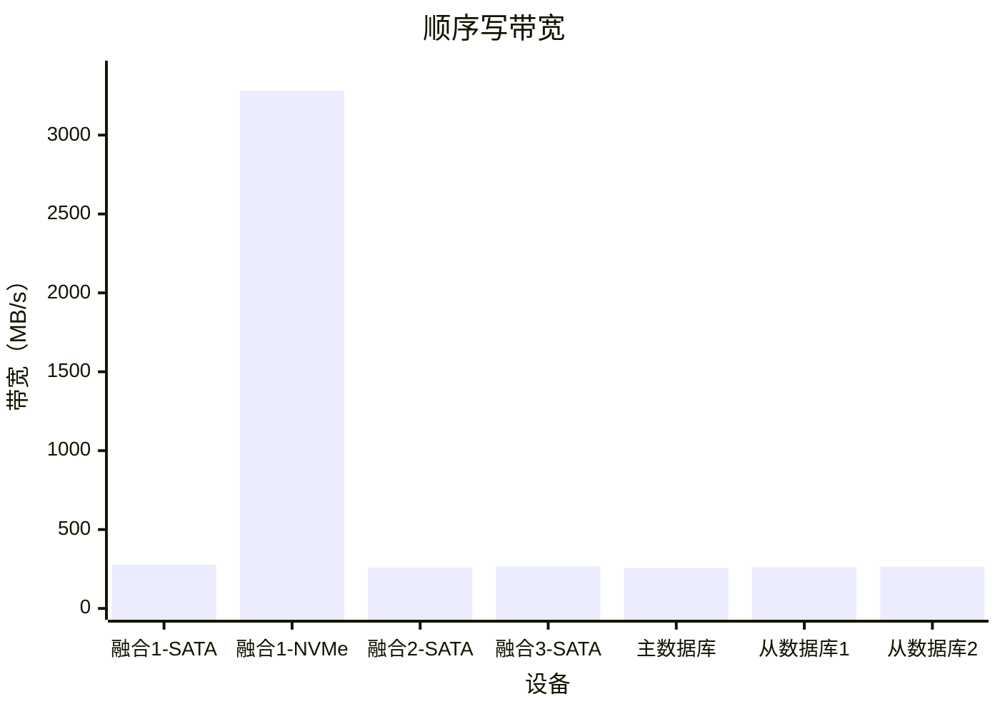

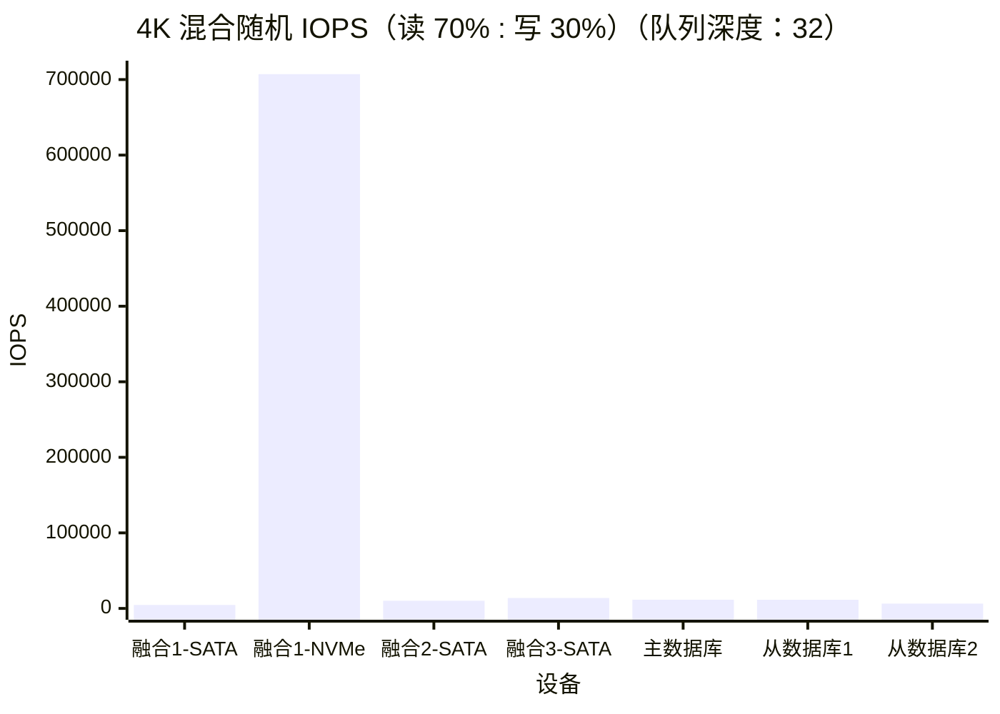

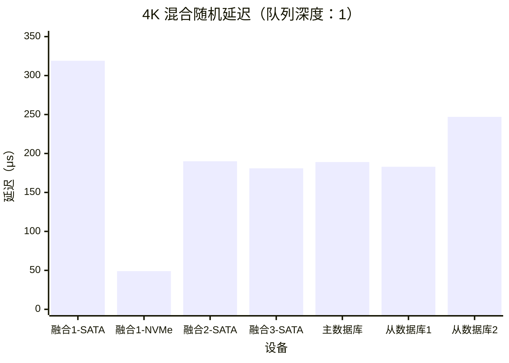

### （可选）硬盘坏块扫描

参考链接：

[固态硬盘扫描坏道的检测意义以及修复方法 - 知乎](https://zhuanlan.zhihu.com/p/685319584)

[【深入浅出SSD】探究固态硬盘SSD卡顿、掉盘、掉速现象 - 知乎](https://zhuanlan.zhihu.com/p/586715739)

[为什么固态会掉盘？著名的30分钟修复是什么原理？这么做对吗？ - 知乎](https://zhuanlan.zhihu.com/p/57617932)

> 在 WinPE 中进行硬盘坏块扫描

在实际使用中，大多数固态硬盘出现故障的原因并非存储颗粒过度擦除的问题，而是主控芯片的固件错误、主控芯片虚焊或物理损伤等其他问题。这些因素往往会导致掉盘或性能下降。

而针对坏块问题，固态硬盘具备 OP 预留空间和 FTL 逻辑映射表的坏块替换功能，这让硬盘的主控芯片能够自动识别并屏蔽坏块，因此用户无需手动进行坏块屏蔽。

然而，S.M.A.R.T. 仅被动记录故障信息，本身无法主动检测坏块。只有当用户恰好读取到损坏区域时，主控芯片才会察觉并更新数据，这导致 S.M.A.R.T. 信息存在滞后性。因此，扫描固态硬盘的坏块可以提前发现那些尚未被 S.M.A.R.T. 表记录的潜在问题区域，从而帮助用户及时采取措施，避免数据丢失或性能下降。

需要指出的是，重要数据备份不应仅仅依赖于存储部件本身的可靠性，而应通过增加冗余备份来提高数据的安全性。具体而言，应遵循数据备份的“3-2-1”原则：至少保持三份数据副本，使用两种不同类型的存储介质进行备份，并确保其中至少一份备份存储在异地。

这里给出超融合集群节点1的SATA系统盘坏块扫描结果：


由于对固态硬盘进行了全盘读取，可能会检测出之前未识别的坏块。在这种情况下，相应的 S.M.A.R.T. 信息也会随之更新。因此，这里应再次查看 S.M.A.R.T. 信息，以判断硬盘是否存在异常。

### （可选）测试固态硬盘 SLC 缓外速度

如果使用场景需要大量向固态硬盘中写入数据，可能会导致硬盘的 SLC 缓存被用尽。在这种情况下，就需要测试固态硬盘的缓外速度。具体方法是向硬盘中写入一个大文件，观察速度何时开始下降。速度下降时的写入空间大小即为 SLC 缓存的容量，而下降后的写入速度则为 SLC 缓外速度。可以使用 HD Tune 的文件基准功能来完成这项测试。

### （附加）固态硬盘开卡重置

> 硬盘开卡会清除所有数据，请在保证数据安全的前提下进行操作。

> 当前固态硬盘的价格已经相当低廉，因此在很多情况下，可以直接更换故障盘，而非开卡。不过，笔者作为一名垃圾佬，本着“又不是不能用”、“又不是修不好”的折腾精神，力求物尽其用，尝试维修故障固态硬盘，重新开卡。

参考链接：

[SSD固态硬盘开卡教程SSD固态硬盘维修 SM2258XT主控硬盘开卡_哔哩哔哩_bilibili](https://www.bilibili.com/video/BV1ai4y1y7Wr/)

[固态硬盘开卡维修常识性知识，SSD量产开卡基础教程_硬盘_什么值得买](https://post.smzdm.com/p/a3x339er/)

[SM2258XT开卡详细教程，SM2259XT2量产可参考，自己动手修复SSD故障-CSDN博客](https://blog.csdn.net/winzen95/article/details/135212757)

[慧荣SM2246XT主控SSD开卡报错compare Flash Fail解决方法-固态硬盘教程-U盘量产网](https://www.upantool.com/jiaocheng/ssd/2018/12216.html)

[固态硬盘坏了怎么办，超详细的固态修复教程，让你想不会都难！_哔哩哔哩_bilibili](https://www.bilibili.com/video/BV1aB4y1d7qm/?spm_id_from=333.788.recommend_more_video.3&vd_source=36470ec62c0fe327f2287e9ac1fd6203)

[2256k 开卡跑RDT，不同设置讨论一下。 - SSD存储技术 数码之家](https://www.mydigit.cn/thread-64395-1-1.html)

由于本教程的固态硬盘为二手杂牌硬盘，加上进行了长时间的稳定性测试，所以笔者有一块固态硬盘出现了故障，无法进行格式化。此种故障大概率是固态硬盘主控固件错误造成的，可以尝试重置硬盘固件解决。这里将对此故障固态硬盘进行维修，以求其恢复其性能。而硬盘中的数据因为其他设备上有高可用备份，所以无需恢复。

- 查看硬盘主控和闪存颗粒型号

  首先查看故障固态硬盘的主控和闪存颗粒型号，此处主控为慧荣 `SM2259XT`，闪存颗粒为三星 `KLUDG4UHDB`​

  

- 下载主控对应量产开卡工具

  Flash 主控和闪存颗粒查询链接：[Flashinfo-您身边的NAND Flash闪存颗粒数据助理](https://flashinfo.top/TextList)

  在固态硬盘颗粒查询网站查询相关信息，此处可知该闪存颗粒的品牌为三星、容量为 128GB、闪存单元为 TLC、闪存制程为 SSV5、晶圆裸片数量 Die 为 4、片选控制 CE 为 4。

  下载主控量产开卡工具，此处因为主控为 `SM2259XT`，闪存颗粒制程为 `SSV5`，则应该寻找文件名包含这两者的量产工具，比如笔者实测文件名为 `SM2259XT(AC)_FSSV5` 的量产工具可以识别此闪存的颗粒型号。当然量产工具的具体命名规则还要根据实际情况而定。

  

  

- 寻找对应闪存颗粒的量产工具

  > 此处以另一块固态硬盘为例，主控为 SM2258XT，闪存颗粒型号为 KLUCG4J1ED，总闪存容量为 64 GB
  >

  > 数码之家的相关发帖中可以寻找到量产工具整合包
  >

  主控信息较容易确定，型号也较统一，但与之搭配的闪存颗粒可能多种多样，寻找合适的量产工具可能比较困难。在这种情况下，可以通过查找闪存颗粒的 `Flash ID` 来确定颗粒料号，然后再从开卡工具中的 `Firmware` 固件文件夹下的 `FWTag.SET` 配置信息中寻找到相应的固件编号。之后在量产工具下载网站中下载对应固件版本的量产工具即可。具体步骤如下：

  1. 在量产工具双击当前硬盘图标，打开当前闪存颗粒的 Flash ID。此处为：`EC3A94C3A4CA`​

  

  2. 查询 Flash ID 对应料号

  Flash 闪存颗粒 ID 查询链接：[FlashMaster - 闪存ID查询](https://fm.itxtech.org/#/decodeId)

  在 Flash 闪存颗粒 ID 查询连接中输入 Flash ID 查询对应的料号。根据 Flash ID 还可以获取到闪存颗粒的厂商、存储单元、容量等其他存储规格信息。此处可知该 Flash ID 有多个料号，如 `K9GDG08U0D`​

  

  3. 确认闪存对应固件编号

  打开量产工具 `Firmware 固件文件夹` 下的 `FWTag.SET 配置文件`，其中包含闪存颗粒对应的固件版本。在此配置文件中搜索刚刚匹配到的料号、同时也可以搜索闪存颗粒物理丝印上的型号。此处搜索到闪存颗粒型号为 K9GDG08U0D 的固件编号为 `SS14`​

  

  4. 寻找对应固件编号的量产开卡工具

  由于匹配的固件编号为 SS14，主控型号又为 SM2258，于是着重寻找附带这两个字段的量产开卡工具。此处匹配到了对应的版本，例如： `SM2258XT_SS14PKGT0107A_FWT0106A0` 。在后面的烧录固件步骤中，实测该版本的工具可用。

  这里可以看到，固态硬盘的主控固件版本并不一定要与闪存颗粒的型号完全匹配，只要闪存颗粒的型号相似，通常也能够成功开卡。

  

- 固态硬盘开卡转接板选择

  SATA接口：一般选用 `ASM1153E` 或 `JMS578` 主控的开卡转接板

  M.2接口（AHCI协议，SATA通道）：一般选用JMS580主控的开卡转接板

  M.2接口（NVME协议，PClE通道）：一般选用JMS583主控的开卡转接板

  此处硬盘为 SATA 接口固态硬盘，因此选择 JMS578 主控的 SATA 转 USB 转接线

- 进行固态硬盘开卡

  首先要先让固态硬盘进入量产开卡模式，其类似于手机的 Bootloader 或者电脑的 BIOS 模式，可在此模式下对固态硬盘的固件进行刷写，以下为操作步骤。

  1. 将固态硬盘插入转接模块中，此处进行了两次转换，先从 mSATA 转为 SATA，再从 SATA 转为 USB。

  

  2. 短接固态硬盘上的 `ROM 引脚` 与地线，即拉低 ROM 引脚电平。然后在短接状态下接通电源，插入电脑 USB 接口，即可进入硬盘的开卡模式。此时可以看见硬盘分区软件将固态硬盘识别为一个容量为 1G 的硬盘，此时即可松开硬盘引脚间的短接。

  

  3. 打开主控对应量产开卡工具，点击 `搜索设备` 扫描硬盘，此时可以看见一个 1GB 的硬盘，并附有相关主控与闪存信息。比如，此处识别此硬盘的主控为 SM2259AC、闪存品牌为三星。

  

  4. 进入 `设定` 页面，点击 `编辑配置` 输入密码，默认为两个空格。然后在 Flash 选择处点击 `自动`，如果开发工具与硬盘匹配的话，会自动识别为合适的 Flash 型号。

      设置与闪存颗粒相符的参数，比如，设置硬盘的容量为 `128GB`，若有需求还可自行设定固态硬盘的名称与序列号等其他参数。​​

      

  5. 设置 RDT 可靠性验证测试

  通过 RDT 可靠性验证测试可以检测闪存颗粒中的坏块。勾选设定页面中的 `RDT 测试`，进入 `RDT 设定`。

  Reference Mode 参考模式选择 Ref pretest bad block Mode 参考之前检测出的坏块。

  SLC Loops 缓存测试轮数一般设置为 `3` 轮。

  Non-SLC Loops 数据测试轮数一般设置为 `3` 轮。

  然后保存 RDT 设置。返回设定界面，保存配置。返回开卡界面点击开始，烧录 RDT 测试固件。

  

  6. 固件烧录完成之后，拔掉数据线，将固态硬盘连接到仅提供电源的USB接口上（无需短接 ROM 引脚），让固态硬盘开始 RDT 测试，此时，固态硬盘提示灯会不停闪烁。测试时间可能持续几十分钟到数个小时，当硬盘提示 `灯常亮`，同时闪存颗粒 `发热降低` 时，即可判定固态硬盘完成了 RDT 可靠性验证测试

  

  7. 查看 DRT 可靠性验证测试结果

  重新将固态硬盘连接到电脑（无需短接 ROM 引脚），打开 `DRT 结果` 页面，等待片刻后，加载出该固态硬盘的闪存坏块信息。此处可以看见笔者的这块故障硬盘竟然一个坏块都没查出来，最大的 `ECC` 纠错位数也才 `15`，看来真是主控固件本身的问题了，要不然就是闪存颗粒在其他特性上有问题。

  

  如果硬盘在使用过程中容易出现 `掉速` 现象，在排除温度因素后，可以怀疑是触发了 ECC 纠错降低了性能。在这种情况下，可以重新进行一轮 RDT 测试，设置一个 `更小的 ECC 阈值`，从而 `屏蔽` 那些需要 `高 ECC 纠错的块`，以优化性能。​​

  8. 确认信息之后返回设定页，关闭 RDT 测试，Pretest 预测试选择 `Reference RDT Bad` 参考 RDT 测试结果，并勾选 `检查和保存 RDT`。

  

  9. 烧录固态硬盘主控固件

  设置完成后点击 `保存配置`，然后返回开卡界面点击 `开始` 进行开卡。

  10. 等待开卡完成，若开卡成功的话对应硬盘图标会提示绿色圆圈，表示该硬盘开卡成功，硬盘已重置完成。

  ​​

  11. 此时，拔掉硬盘连接线，然后关闭开卡工具。在关闭开卡工具的情况下，重新连接硬盘到电脑，即可正常使用此固态硬盘。

  我们可以看下其的 S.M.A.R.T. 信息，发现已经被重置清零，这也可以说明为什么 S.M.A.R.T. 信息不能作为评判固态硬盘使用情况的唯一标准。

  

  12. 为了确保硬盘容量真实可用，还可以进行一轮全盘读写测试，测试前需要先对硬盘进行分区。

  ​​

  13. 然后可以快速测一下硬盘的性能，确保可以正常使用。

  

## 功耗与散热测试

### 方式一：WinPE 工具功耗测试

> 在 Windows PE 中进行系统功耗测试

> 此方式适用于在组装硬件的过程测试单个设备，便于随时调试相关硬件

在 WinPE 系统中仅做待机与满载测试，目前未找到在此系统中进行特定负载测试的方法。

进入 WinPE 系统后不做任何操作保持开机状态，即可视为进行待机测试

进入 WinPE 系统后可使用 AIDA64 等压力测试工具进行满载测试

### 方式二：stress-ng 功耗测试

- 安装 stress-ng

```bash
sudo apt -y update && sudo apt -y install stress-ng
```

- 模拟日常负载测试

模拟中等数据库或虚拟化节点日常负载：

所有 `CPU负载 33%` 占用，`内存负载 50%` 持续读写，`硬盘负载 40%` 混合随机读写

```bash
# 设置期望的系统总CPU使用百分比 (0-100)
PERCENT=33

# 自动计算多核系统的真实配额
# 公式：CPUQuota = (百分比 × CPU核心数)%
CPUQUOTA=$(( PERCENT * $(nproc) ))

# cpu 和 内存 一直跑
sudo systemd-run --scope -p CPUQuota="${CPUQUOTA}%" \
  stress-ng \
	--cpu 0 --cpu-load $(nproc) \
	--vm 2 --vm-bytes 50% \
	--timeout 600s &

# 硬盘 40 % 占空比循环（1 s 周期，跑 0.4 s）
for i in $(seq 600); do
  # 盘 1 指定目录
  sudo stress-ng --iomix 1 --temp-path /root --timeout 400ms &
  PID1=$!
  # 盘 2 指定目录
  # sudo stress-ng --iomix 1 --temp-path /mnt/pve/nvme --timeout 400ms &
  # PID2=$!

  sleep 0.4
  sudo kill $PID1 $PID2 2>/dev/null
  wait $PID1 $PID2 2>/dev/null
  sleep 0.6
done
```

- 满载测试

CPU、内存、硬盘均满载

```bash
# 盘 1 指定目录
sudo stress-ng --iomix 1 --temp-path /root --timeout 600s &
# 盘 2 指定目录
# sudo stress-ng --iomix 1 --temp-path /mnt/pve/nvme --timeout 1800s &

sudo stress-ng \
  --cpu 0 --cpu-method all `# 所有逻辑核 100 %` \
  --vm 0 --vm-bytes 95% `# 锁定 95 % 物理内存` \
  --timeout 600s `# 10 min；0 表示永久`
```

- 停止测试

```bash
sudo pkill -f stress-ng
sudo pkill -f stress-ng
sudo pkill -f stress-ng
```

### 超融合节点1功耗与温度

> 测试时的环境温度约为 26 度

- 一般电源与下压式散热器功耗

主服务器最开始使用的是一般电源供电，下压式散热器散热，此时实测待机功耗约为 80W，CPU 满载功耗约为 300W，CPU 满载温度超过 90 度​​

- 金牌电源与下压式散热器功耗

为了改善电源效率，改用金牌电源供电，此时实测待机功耗约为 70W，CPU 满载功耗约为 210W，CPU 满载温度不超过 90 度。与一般电源相比，待机功耗下降了约 12%，CPU 满载功耗下降了约 30%。

- 金牌电源与塔式散热器功耗

由于散热效果较差，改用塔式散热器散热，更换散热器后 CPU 满载温度维持在 60 度以下。与下压式散热器相比，CPU 满载温度下降了约 30 度。然后将主板放入机箱，后续使用时也均会保持主板在机箱内，这时的实测待机功耗约为 `70W`，日常负载功耗约为 `145W`，满载功耗约为 `230W`，CPU 满载温度维持在 `70 度以下`。


​​

​​


### 系统总功耗

> 此处测试的设备为：所有服务器以及路由器与交换机

- 待机功耗

安装完操作系统后不进行操作的功耗，实测整个系统待机功耗约为 `100W`。


- 模拟日常负载测试

模拟中等数据库或虚拟化节点日常负载：所有 `CPU 负载 33%` 占用，`内存负载 50%` 持续读写，`硬盘负载 40%` 混合随机读写。

实测整个系统模拟日常负载测试约为 `190W`。


​​

- 满载功耗

实测整个系统CPU、内存、硬盘均满载时功耗约为 `290W`。


‍
